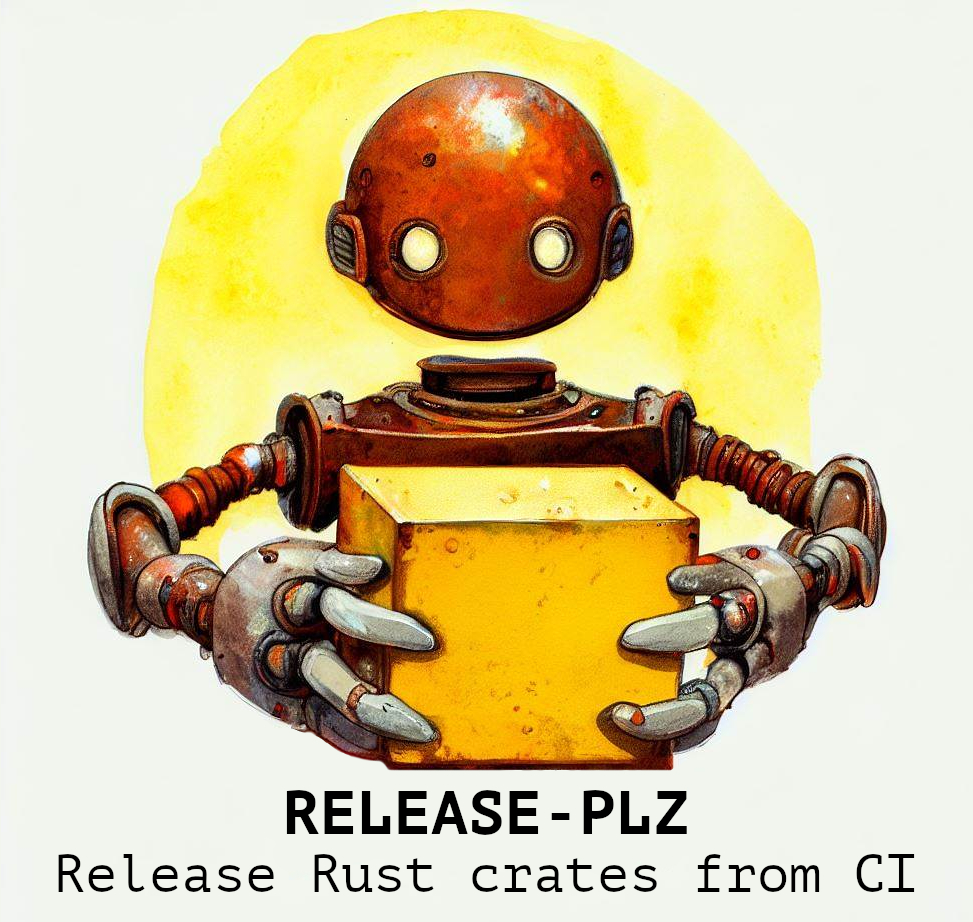

Release-plz helps you release your Rust packages by automating:
- CHANGELOG generation (with [git-cliff](https://github.com/orhun/git-cliff))
- Creation of GitHub/Gitea releases
- Publishing to a cargo registry (`crates.io` by default)
- Version bumps.

Release-plz updates your packages with a release Pull Request based on:
- Your git history, following [Conventional commits](https://www.conventionalcommits.org/)
- API breaking changes (detected by [cargo-semver-checks](https://github.com/obi1kenobi/cargo-semver-checks))

## What's a Release PR?

Rather than continuously releasing what's landed to your default branch,
release-plz maintains Release PRs:

These Release PRs are kept up-to-date as additional work is merged. When you're
ready to tag a release, simply merge the release PR.

When the Release PR is merged (or when you edit the `Cargo.toml` versions by yourself),
release-plz takes the following steps:

- Creates a git tag named `<package_name>-v<version>` (e.g. `tokio-v1.8.1`).
- Publishes the package to the cargo registry by running `cargo publish`.
- Publishes a GitHub/Gitea release based on the git tag.

## Docs

Learn how to use release-plz in the mdbook [docs](https://marcoieni.github.io/release-plz/).

## Users

[This](https://github.com/search?type=code&q=path%3A*.yml+OR+path%3A*.yaml+MarcoIeni%2Frelease-plz-action)
search
and [this](https://github.com/MarcoIeni/release-plz-action/network/dependents)
page show the public GitHub repositories using release-plz in CI.

## Similar projects

- [release-please](https://github.com/googleapis/release-please): release-plz is inspired by release-please,
  but instead of determining the next versions based on git tags, release-plz compares local packages with
  the ones published in the cargo registry.
  Plus, release-plz doesn't need any configuration and is optimized for Rust projects.
- [cargo smart-release](https://github.com/Byron/gitoxide/tree/main/cargo-smart-release):
  Fearlessly release workspace crates and with beautiful semi-handcrafted changelogs.

## Credits

Parts of the codebase are inspired by:
- [cargo-clone](https://github.com/JanLikar/cargo-clone)
- [cargo-edit](https://github.com/killercup/cargo-edit)
- [cargo-release](https://github.com/crate-ci/cargo-release)
- [cargo-workspaces](https://github.com/pksunkara/cargo-workspaces)
- [git-cliff](https://github.com/orhun/git-cliff)

 

Licensed under either of <a href="LICENSE-APACHE">Apache License, Version 2.0</a>
or <a href="LICENSE-MIT">MIT license</a> at your option.

 

Unless you explicitly state otherwise, any contribution intentionally submitted
for inclusion in the work by you, as defined in the Apache-2.0 license, shall be
dual licensed as above, without any additional terms or conditions.

