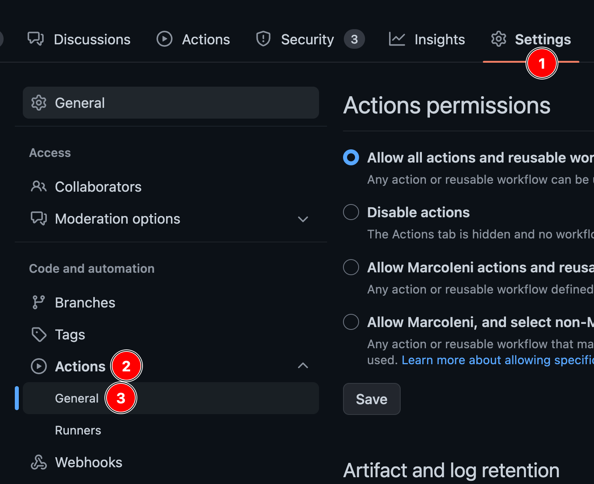
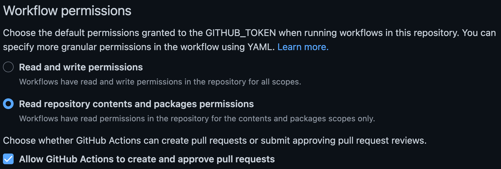

# GitHub action

The simplest way to run release-plz is via the [GitHub action](https://github.com/marketplace/actions/release-plz).

By default, every time you merge a commit to the main branch, the GitHub action
runs two commands, one after the other:

- [`release-plz release-pr`](usage/release-pr.md): creates the release pr.
- [`release-plz release`](usage/release.md): publishes the unpublished packages.

## Input variables

- `command`: The release-plz command to run. Accepted values: `release-pr`,
  `release`. (By default it runs both commands).
- `registry`: Registry where the packages are stored.
  The registry name needs to be present in the Cargo config.
  If unspecified, crates.io is used. (Defaults to crates.io).
- `no_changelog`: Don't create changelog. (Default: `"false"`).
- `update_dependencies`: If `true`, update all the dependencies in the Cargo.lock
  file by running `cargo update`.
  If `false`, only update the workspace packages by running
  `cargo update --workspace`. (Default: `false`).
- `project_manifest`: Path to the Cargo.toml of the project you want to update.
  Both Cargo workspaces and single packages are supported. (Defaults to the root
  directory).
- `changelog_config`: Path to the git cliff configuration file.
  (Defaults to the [keep a changelog](https://keepachangelog.com/en/1.1.0/) configuration).
- `git_release`: Publish the GitHub release for the created git tag. (Default: `true`).
- `version`: Release-plz version to use. It must be an existing git tag name. For example `release-plz-v0.2.45`. (Default: `"latest"`).

## Example: release-pr and release

```yaml
name: Release-plz

permissions:
  pull-requests: write
  contents: write

on:
  push:
    branches:
      - main

jobs:
  release-plz:
    name: Release-plz
    runs-on: ubuntu-latest
    steps:
      - name: Checkout repository
        uses: actions/checkout@v3
        with:
          fetch-depth: 0
      - name: Install Rust toolchain
        uses: dtolnay/rust-toolchain@stable
      - name: Run release-plz
        uses: MarcoIeni/release-plz-action@0.4
        env:
          GITHUB_TOKEN: ${{ secrets.GITHUB_TOKEN }}
          CARGO_REGISTRY_TOKEN: ${{ secrets.CARGO_REGISTRY_TOKEN }}
```

- `fetch-depth: 0` is needed to clone all the git history, which is necessary to
  determine the next version and build the changelog.

## Example: release-pr

```yaml
name: Release-plz

permissions:
  pull-requests: write
  contents: write

on:
  push:
    branches:
      - main

jobs:
  release-plz:
    name: Release-plz
    runs-on: ubuntu-latest
    steps:
      - name: Checkout repository
        uses: actions/checkout@v3
        with:
          fetch-depth: 0
      - name: Install Rust toolchain
        uses: dtolnay/rust-toolchain@stable
      - name: Run release-plz
        uses: MarcoIeni/release-plz-action@0.4
        with:
          command: release-pr
        env:
          GITHUB_TOKEN: ${{ secrets.GITHUB_TOKEN }}
```

## Example: release

```yaml
name: Release-plz

permissions:
  pull-requests: write
  contents: write

on:
  push:
    branches:
      - main

jobs:
  release-plz:
    name: Release-plz
    runs-on: ubuntu-latest
    steps:
      - name: Checkout repository
        uses: actions/checkout@v3
        with:
          fetch-depth: 0
      - name: Install Rust toolchain
        uses: dtolnay/rust-toolchain@stable
      - name: Run release-plz
        uses: MarcoIeni/release-plz-action@0.4
        with:
          command: release
        env:
          GITHUB_TOKEN: ${{ secrets.GITHUB_TOKEN }}
          CARGO_REGISTRY_TOKEN: ${{ secrets.CARGO_REGISTRY_TOKEN }}
```

## Change GitHub actions permissions

1. Go to the GitHub actions settings:

   

2. Change "Workflow permissions" to allow GitHub actions to create and approve
   pull requests (needed to create and update the PR).

   

## Triggering further workflow runs

Pull requests created by GitHub actions using the default `GITHUB_TOKEN` cannot
trigger other workflows.
If you have `on: pull_request` or `on: push` workflows acting as checks on pull
requests, they will not run.

> When you use the repository's `GITHUB_TOKEN` to perform tasks, events triggered
by the `GITHUB_TOKEN` will not create a new workflow run.
This prevents you from accidentally creating recursive workflow runs.
For example, if a workflow run pushes code using the repository's `GITHUB_TOKEN`,
a new workflow will not run even when the repository contains a workflow
configured to run when `push` events occur.

-- [GitHub Actions: Triggering a workflow from a workflow](https://docs.github.com/en/actions/using-workflows/triggering-a-workflow#triggering-a-workflow-from-a-workflow)

Read [this](https://github.com/peter-evans/create-pull-request/blob/main/docs/concepts-guidelines.md#triggering-further-workflow-runs)
guide to learn about possible workarounds, such as setting a Personal Access
Token, a deploy key or a GitHub app.
