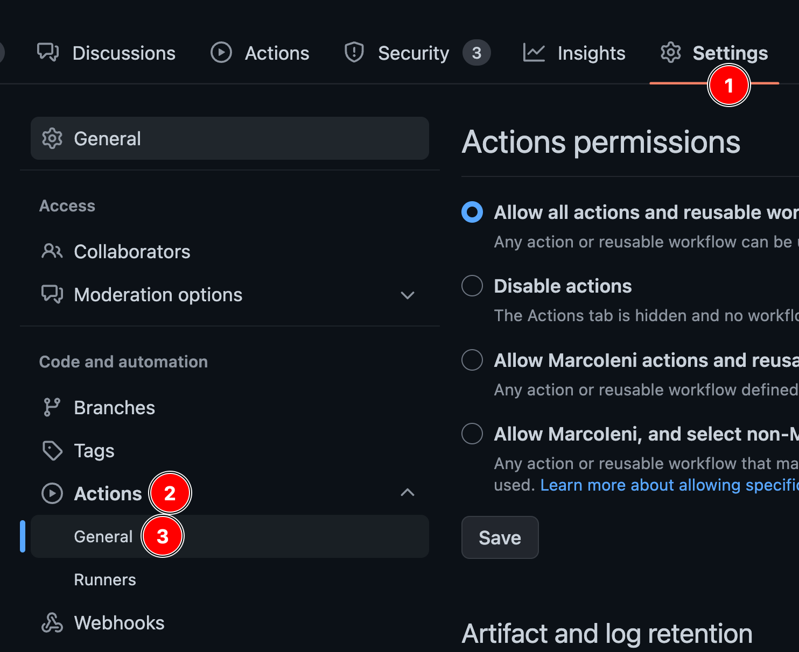

# GitHub Action

The simplest way to run release-plz is via the [GitHub Action](https://github.com/marketplace/actions/release-plz).

By default, every time you merge a commit to the main branch, the GitHub Action
runs two commands, one after the other:

- [`release-plz release-pr`](../usage/release-pr.md): creates the release pr.
- [`release-plz release`](../usage/release.md): publishes the unpublished packages.

## Input variables

- `command`: The release-plz command to run. Accepted values: `release-pr`,
  `release`. (By default it runs both commands).
- `registry`: Registry where the packages are stored.
  The registry name needs to be present in the Cargo config.
  If unspecified, crates.io is used. (Defaults to crates.io).
- `project_manifest`: Path to the Cargo.toml of the project you want to update.
  Both Cargo workspaces and single packages are supported. (Defaults to the root
  directory).
- `version`: Release-plz version to use. It must be an existing git tag name.
  For example `release-plz-v0.2.45`. (Default: `"latest"`).

## Example: release-pr and release

This is the suggested configuration if you are getting started with release-plz.
With this configuration, release-plz both updates and publishes your project.
When you make changes to the `main` branch:
- release-plz creates a pull request with the new versions, where it prepares the next release.
- release-plz releases the unpublished packages.

```yaml
name: Release-plz

permissions:
  pull-requests: write
  contents: write

on:
  push:
    branches:
      - main

jobs:
  release-plz:
    name: Release-plz
    runs-on: ubuntu-latest
    steps:
      - name: Checkout repository
        uses: actions/checkout@v3
        with:
          fetch-depth: 0
      - name: Install Rust toolchain
        uses: dtolnay/rust-toolchain@stable
      - name: Run release-plz
        uses: MarcoIeni/release-plz-action@v0.5
        env:
          GITHUB_TOKEN: ${{ secrets.GITHUB_TOKEN }}
          CARGO_REGISTRY_TOKEN: ${{ secrets.CARGO_REGISTRY_TOKEN }}
```

- `fetch-depth: 0` is needed to clone all the git history, which is necessary to
  determine the next version and build the changelog.

## Example: release-pr

```yaml
name: Release-plz

permissions:
  pull-requests: write
  contents: write

on:
  push:
    branches:
      - main

jobs:
  release-plz:
    name: Release-plz
    runs-on: ubuntu-latest
    steps:
      - name: Checkout repository
        uses: actions/checkout@v3
        with:
          fetch-depth: 0
      - name: Install Rust toolchain
        uses: dtolnay/rust-toolchain@stable
      - name: Run release-plz
        uses: MarcoIeni/release-plz-action@v0.5
        with:
          command: release-pr
        env:
          GITHUB_TOKEN: ${{ secrets.GITHUB_TOKEN }}
```

## Example: release

```yaml
name: Release-plz

permissions:
  pull-requests: write
  contents: write

on:
  push:
    branches:
      - main

jobs:
  release-plz:
    name: Release-plz
    runs-on: ubuntu-latest
    steps:
      - name: Checkout repository
        uses: actions/checkout@v3
        with:
          fetch-depth: 0
      - name: Install Rust toolchain
        uses: dtolnay/rust-toolchain@stable
      - name: Run release-plz
        uses: MarcoIeni/release-plz-action@v0.5
        with:
          command: release
        env:
          GITHUB_TOKEN: ${{ secrets.GITHUB_TOKEN }}
          CARGO_REGISTRY_TOKEN: ${{ secrets.CARGO_REGISTRY_TOKEN }}
```

## Example: release-pr and relase on schedule

In the above examples, release-plz runs every time you merge a commit to the `main` branch.

To run release-plz periodically, you can use the
[`schedule`](https://docs.github.com/en/actions/reference/events-that-trigger-workflows#schedule) event:

```yaml
name: Release-plz

permissions:
  pull-requests: write
  contents: write

# Trigger the workflow every Monday.
on:
  schedule:
    # * is a special character in YAML so you have to quote this string
    - cron:  '0 0 * * MON'

jobs:
  release-plz:
    name: Release-plz
    runs-on: ubuntu-latest
    steps:
      - name: Checkout repository
        uses: actions/checkout@v3
        with:
          fetch-depth: 0
      - name: Install Rust toolchain
        uses: dtolnay/rust-toolchain@stable
      - name: Run release-plz
        uses: MarcoIeni/release-plz-action@v0.5
        env:
          GITHUB_TOKEN: ${{ secrets.GITHUB_TOKEN }}
          CARGO_REGISTRY_TOKEN: ${{ secrets.CARGO_REGISTRY_TOKEN }}
```

## Change GitHub Actions permissions

1. Go to the GitHub Actions settings:

   

2. Change "Workflow permissions" to allow GitHub Actions to create and approve
   pull requests (needed to create and update the PR).

   
