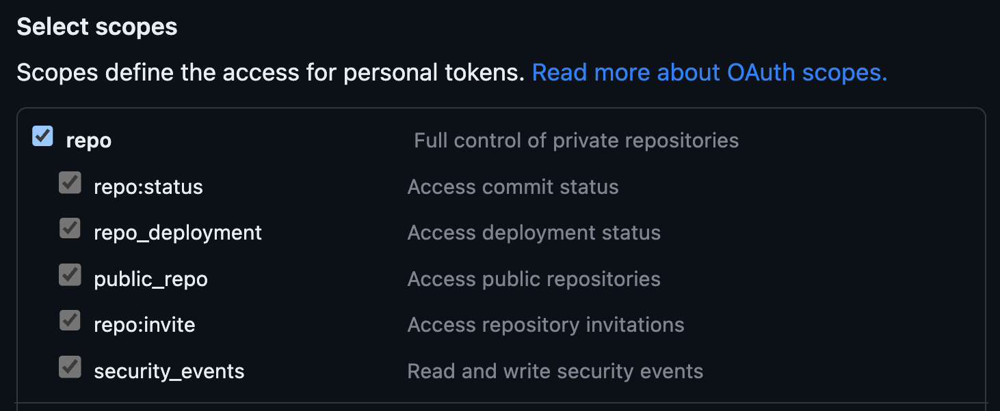
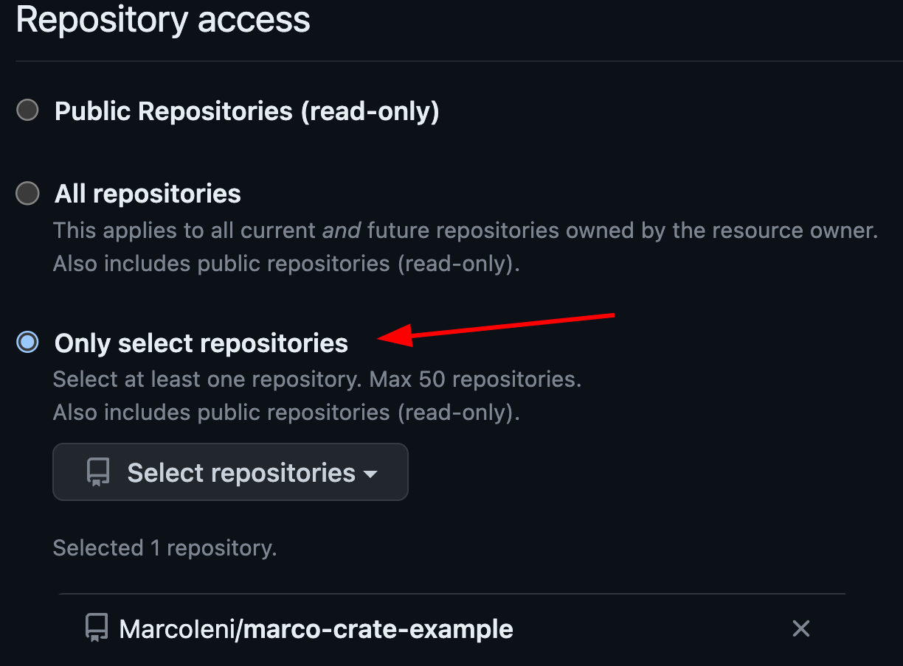
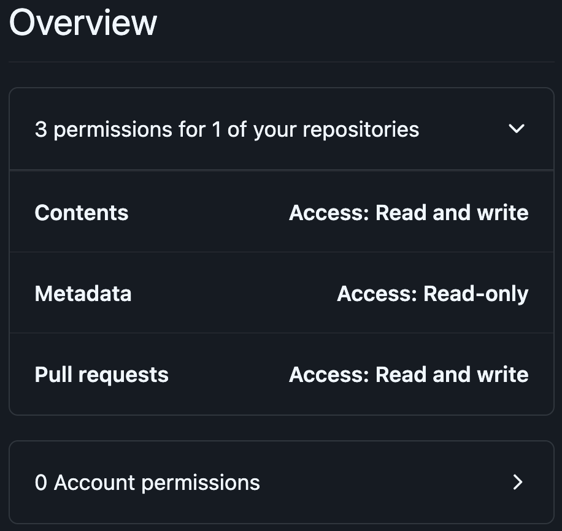

# Triggering further workflow runs

GitHub Actions using the default
[`GITHUB_TOKEN`](https://docs.github.com/en/actions/security-guides/automatic-token-authentication)
cannot trigger other workflows.
For example:
- `on: pull_request` or `on: push` workflows acting as checks on pull
  requests opened by GitHub Actions won't run.
- `on: release` or `on: push: tags` workflows acting on releases or
  tags created by GitHub actions won't run.

You can learn more in the GitHub
[docs](https://docs.github.com/en/actions/using-workflows/triggering-a-workflow#triggering-a-workflow-from-a-workflow).

## How to trigger further workflow runs

Release-plz doesn't need to trigger further workflow runs to release your packages.
However, if you want to run CI checks on the release PR,
or if you want to trigger another workflow after release-plz pushes
a tag or creates a release, you need to use one of the following methods.

### Trigger workflow manually

To run `on: pull_request` workflows you can manually close and reopen the release pull request.

### Use a Personal Access Token

Use a [Personal Access Token (PAT)](https://docs.github.com/en/github/authenticating-to-github/creating-a-personal-access-token)
created on an account with write access to the repository.
This is the standard method
[recommended by GitHub](https://docs.github.com/en/actions/using-workflows/triggering-a-workflow#triggering-a-workflow-from-a-workflow).
Note that the account that owns the PAT will be the author of the release pull request.
Create the PAT, choosing one of the two types:
- [Classic](https://docs.github.com/en/authentication/keeping-your-account-and-data-secure/creating-a-personal-access-token#personal-access-tokens-classic):
  less secure because you can't scope it to a single repository.
  Release-plz needs `repo` permissions:
  
- [Fine-grained](https://docs.github.com/en/authentication/keeping-your-account-and-data-secure/creating-a-personal-access-token#fine-grained-personal-access-tokens):
  more secure because you can select the repositories where the PAT can be used.
  Release-plz needs the following:
  - Select the repositories where you want to use the PAT, to give release-plz write access:
    
  - Assign "Contents" and "Pull requests" read and write permissions:
    

Once you generated your token, and saved it in the
[secrets](https://docs.github.com/en/actions/security-guides/encrypted-secrets),
pass it to both the `actions/checkout` and `release-plz` actions:

```yaml
jobs:
  release-plz:
    name: Release-plz
    runs-on: ubuntu-latest
    steps:
      - name: Checkout repository
        uses: actions/checkout@v3
        with:
          fetch-depth: 0
          token: ${{ secrets.MY_GITHUB_TOKEN }} # <-- Your token here
      - name: Install Rust toolchain
        uses: dtolnay/rust-toolchain@stable
      - name: Run release-plz
        uses: MarcoIeni/release-plz-action@v0.5
        env:
          GITHUB_TOKEN: ${{ secrets.MY_GITHUB_TOKEN }} # <-- Your token here
          CARGO_REGISTRY_TOKEN: ${{ secrets.CARGO_REGISTRY_TOKEN }}
```

### Use a GitHub Action

Generate a GitHub token with a GitHub App.
This is the approach used by the
[release-plz](https://github.com/MarcoIeni/release-plz/blob/main/.github/workflows/release-plz.yml)
repo itself. With this approach, the GitHub App will be the author of the release pull request.
Here's how to use a GitHub app to generate a GitHub token:

1. Create a minimal [GitHub App](https://docs.github.com/en/developers/apps/creating-a-github-app),
   setting the following fields:
   - Set `GitHub App name`.
   - Set `Homepage URL` to anything you like, such as your GitHub profile page.
   - Uncheck `Active` under `Webhook`. You do not need to enter a `Webhook URL`.
   - Under `Repository permissions: Contents` select `Access: Read & write`.
   - Under `Repository permissions: Pull requests` select `Access: Read & write`.
   - (Optional) Set the release-plz [logo](../assets/robot_head.jpeg)

2. Create a Private key from the App settings page and store it securely.

3. Install the App on any repository where workflows will run requiring tokens.

4. Set secrets on your repository containing the GitHub App ID, and the private
   key you created in step 2. e.g. `APP_ID`, `APP_PRIVATE_KEY`.

5. The following example workflow shows how to use
   [tibdex/github-app-token](https://github.com/tibdex/github-app-token)
   to generate a token for use with this action.

```yaml
steps:
  # Generating a GitHub token, so that PRs and tags created by
  # the release-plz-action can trigger actions workflows.
  - name: Generate GitHub token
    uses: tibdex/github-app-token@v1
    id: generate-token
    with:
      app_id: ${{ secrets.APP_ID }}
      private_key: ${{ secrets.APP_PRIVATE_KEY }}
  - name: Checkout repository
    uses: actions/checkout@v3
    with:
      fetch-depth: 0
      token: ${{ steps.generate-token.outputs.token }}
  - name: Install Rust toolchain
    uses: dtolnay/rust-toolchain@stable
  - name: Run release-plz
    uses: MarcoIeni/release-plz-action@main
    env:
      GITHUB_TOKEN: ${{ steps.generate-token.outputs.token }}
      CARGO_REGISTRY_TOKEN: ${{ secrets.CARGO_REGISTRY_TOKEN }}
```

## How to trigger further workflows

You can trigger workflows on different
[events](https://docs.github.com/en/actions/using-workflows/events-that-trigger-workflows).
For example:

- When a GitHub release is published:

  ```yaml
  on:
    release:
      types: [published]
  ```

- When a git tag is pushed:

  ```yaml
  on:
    push:
      tags:
        - "*"
   ```
