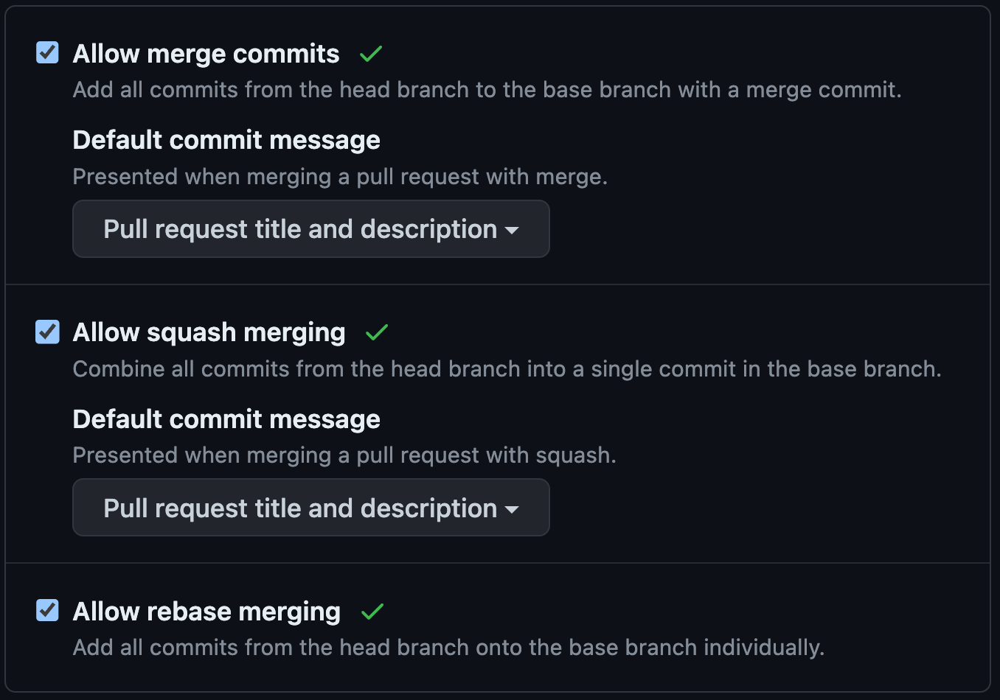

# Advanced Configuration

## Git submodules

If your repository uses git submodules, set the `submodules` option in the `actions/checkout` step:

- `submodules: true` to checkout submodules.
- `submodules: recursive` to recursively checkout submodules.

For example:

```yaml
jobs:
  release-plz:
    name: Release-plz
    runs-on: ubuntu-latest
    steps:
      - name: Checkout repository
        uses: actions/checkout@v4
        with:
          fetch-depth: 0
          submodules: recursive # <-- Add this line
```

To learn more, see GitHub [docs](https://github.com/actions/checkout/).

## Add more info to commit message

By default, the commit message of the release PR only contains `chore: release`.
To add the PR title and description to the default commit message when merging a pull request,
change the GitHub repository settings under "General":



You can learn more in the
[announcement](https://github.blog/changelog/2022-08-23-new-options-for-controlling-the-default-commit-message-when-merging-a-pull-request/)
and
[docs](https://docs.github.com/en/repositories/configuring-branches-and-merges-in-your-repository/configuring-pull-request-merges/configuring-commit-squashing-for-pull-requests).

## Add additional checks before releasing

To release your crates, Release-plz runs `cargo publish`, which checks if your code
compile before publishing to the cargo registry.

If you want to run other checks before releasing (e.g. `cargo test`), you have two options:

1. *(preferred)* Add the checks in other GitHub actions and run them in the Pull Requests.
   Only merge a PR if the checks are successful.
   The pro of this approach, is that release-plz and your checks run in parallel.
2. Add the checks to the GitHub action before running release-plz:

   ```yml
   jobs:
     release-plz:
       name: Release-plz
       runs-on: ubuntu-latest
       steps:
         - name: Checkout repository
           uses: actions/checkout@v4
           with:
             fetch-depth: 0
         - name: Install Rust toolchain
           uses: dtolnay/rust-toolchain@stable
         - uses: Swatinem/rust-cache@v2
         - run: cargo test # <-- put any check you like here
         - name: Run release-plz
           uses: MarcoIeni/release-plz-action@v0.5
           env:
             GITHUB_TOKEN: ${{ secrets.GITHUB_TOKEN }}
             CARGO_REGISTRY_TOKEN: ${{ secrets.CARGO_REGISTRY_TOKEN }}
   ```

   The con of this approach, is that the release-plz action will complete later
   because it needs to wait for the other checks to finish.
