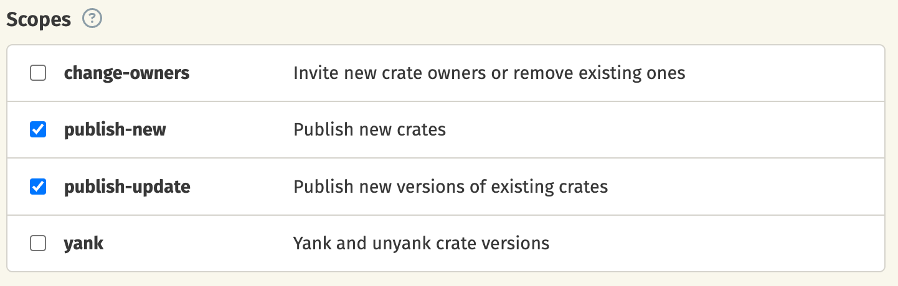

# Quickstart

This guide shows how to run the release-plz
[GitHub Action](https://github.com/marketplace/actions/release-plz)
every time you merge a commit to the main branch.
The workflow will have two jobs, running the following commands:

- [`release-plz release-pr`](../usage/release-pr.md): creates the release pr.
- [`release-plz release`](../usage/release.md): publishes the unpublished packages.

Follow the steps below to set up the GitHub Action.

## 1. Change GitHub Actions permissions

1. Go to the GitHub Actions settings:

   

2. Change "Workflow permissions" to allow GitHub Actions to create and approve
   pull requests (needed to create and update the PR).

   

## 2. Set the `CARGO_REGISTRY_TOKEN` secret

Release-plz needs a token to publish your packages to the cargo registry.

1. Retrieve your registry token following
   [this](https://doc.rust-lang.org/cargo/reference/publishing.html#before-your-first-publish)
   guide.
2. Add your cargo registry token as a secret in your repository following
   [this](https://docs.github.com/en/actions/security-guides/encrypted-secrets#creating-encrypted-secrets-for-a-repository)
   guide.

As specified in the `cargo publish`
[options](https://doc.rust-lang.org/cargo/commands/cargo-publish.html#publish-options):

- The token for [crates.io](https://crates.io/) shall be specified with the `CARGO_REGISTRY_TOKEN`
  environment variable.
- Tokens for other registries shall be specified with environment variables of the form
  `CARGO_REGISTRIES_NAME_TOKEN` where `NAME` is the name of the registry in all capital letters.

If you are creating a new crates.io token, specify the scopes `publish-new` and `publish-update`:



## 3. Setup the workflow

Create the release-plz workflow file under the `.github/workflows` directory
(for example `.github/workflows/release-plz.yml`)
and copy the following workflow:

```yaml
name: Release-plz

permissions:
  pull-requests: write
  contents: write

on:
  push:
    branches:
      - main

jobs:

  # Release unpublished packages.
  release-plz-release:
    name: Release-plz release
    runs-on: ubuntu-latest
    steps:
      - name: Checkout repository
        uses: actions/checkout@v4
        with:
          fetch-depth: 0
      - name: Install Rust toolchain
        uses: dtolnay/rust-toolchain@stable
      - name: Run release-plz
        uses: MarcoIeni/release-plz-action@v0.5
        with:
          command: release
        env:
          GITHUB_TOKEN: ${{ secrets.GITHUB_TOKEN }}
          CARGO_REGISTRY_TOKEN: ${{ secrets.CARGO_REGISTRY_TOKEN }}

  # Create a PR with the new versions and changelog, preparing the next release.
  release-plz-pr:
    name: Release-plz PR
    runs-on: ubuntu-latest
    concurrency:
      group: release-plz-${{ github.ref }}
      cancel-in-progress: false
    steps:
      - name: Checkout repository
        uses: actions/checkout@v4
        with:
          fetch-depth: 0
      - name: Install Rust toolchain
        uses: dtolnay/rust-toolchain@stable
      - name: Run release-plz
        uses: MarcoIeni/release-plz-action@v0.5
        with:
          command: release-pr
        env:
          GITHUB_TOKEN: ${{ secrets.GITHUB_TOKEN }}
          CARGO_REGISTRY_TOKEN: ${{ secrets.CARGO_REGISTRY_TOKEN }}
```

<details>
<summary>Workflow explanation</summary>

This optional section adds comments to the above workflow,
to explain it in detail.

```yaml
# Name of the workflow: you can change it.
name: Release-plz

permissions:
  # Used to create and update pull requests.
  pull-requests: write
  # Used to push to branches, push tags, and create releases.
  contents: write

# The action runs on every push to the main branch.
on:
  push:
    branches:
      - main

jobs:

  # Release unpublished packages.
  # If you want release-plz to only update your packages,
  # and you want to handle `cargo publish` and git tag push by yourself,
  # remove this job.
  release-plz-release:
    name: Release-plz release
    runs-on: ubuntu-latest
    steps:
      - name: Checkout repository
        uses: actions/checkout@v4
        with:
          # `fetch-depth: 0` is needed to clone all the git history, which is necessary to
          # release from the latest commit of the release PR.
          fetch-depth: 0
      # Use your favorite way to install the Rust toolchain.
      # The action I'm using here is a popular choice.
      - name: Install Rust toolchain
        uses: dtolnay/rust-toolchain@stable
      - name: Run release-plz
        uses: MarcoIeni/release-plz-action@v0.5
        with:
          # Run `release-plz release` command.
          command: release
        env:
          GITHUB_TOKEN: ${{ secrets.GITHUB_TOKEN }}
          CARGO_REGISTRY_TOKEN: ${{ secrets.CARGO_REGISTRY_TOKEN }}

  # Create a PR with the new versions and changelog, preparing the next release.
  # If you want release-plz to only release your packages
  # and you want to update `Cargo.toml` versions and changelogs by yourself,
  # remove this job.
  release-plz-pr:
    name: Release-plz PR
    runs-on: ubuntu-latest
    # The concurrency block is explained below (after the code block).
    concurrency:
      group: release-plz-${{ github.ref }}
      cancel-in-progress: false
    steps:
      - name: Checkout repository
        uses: actions/checkout@v4
        with:
          # `fetch-depth: 0` is needed to clone all the git history, which is necessary to
          # determine the next version and build the changelog.
          fetch-depth: 0
      - name: Install Rust toolchain
        uses: dtolnay/rust-toolchain@stable
      - name: Run release-plz
        uses: MarcoIeni/release-plz-action@v0.5
        with:
          # Run `release-plz release-pr` command.
          command: release-pr
        env:
          GITHUB_TOKEN: ${{ secrets.GITHUB_TOKEN }}
          # In `release-plz-pr` this is only required if you are using a private registry.
          CARGO_REGISTRY_TOKEN: ${{ secrets.CARGO_REGISTRY_TOKEN }}
```

### Concurrency

The `concurrency` block guarantees that if a new commit is pushed while
the job of the previous commit was still running, the new job will
wait for the previous one to finish.
In this way, only one instance of `release-plz release-pr` will run in the
repository at the same time for # the same branch, ensuring that there are
no conflicts.
See the GitHub [docs](https://docs.github.com/en/actions/writing-workflows/workflow-syntax-for-github-actions#jobsjob_idconcurrency)
to learn more.

We can't use the same `concurrency` block in the `release-plz-release` job
because the `concurrency` block cancels the pending job if a new commit is
pushed — we can't risk to skip a release.
This is an example commit sequence where the release would be skipped:

- Commit 1: an initial commit is pushed to the main branch. `release-plz release` runs.
- Commit 2: a second commit is pushed to the main branch. The job of this commit is pending,
  waiting for Release-plz to finish on Commit 1.
- Commit 3: a third commit is pushed to the main branch. The job of commit 2 is canceled,
  and the job of commit 3 is pending, waiting for Release-plz to finish on Commit 1.

</details>
