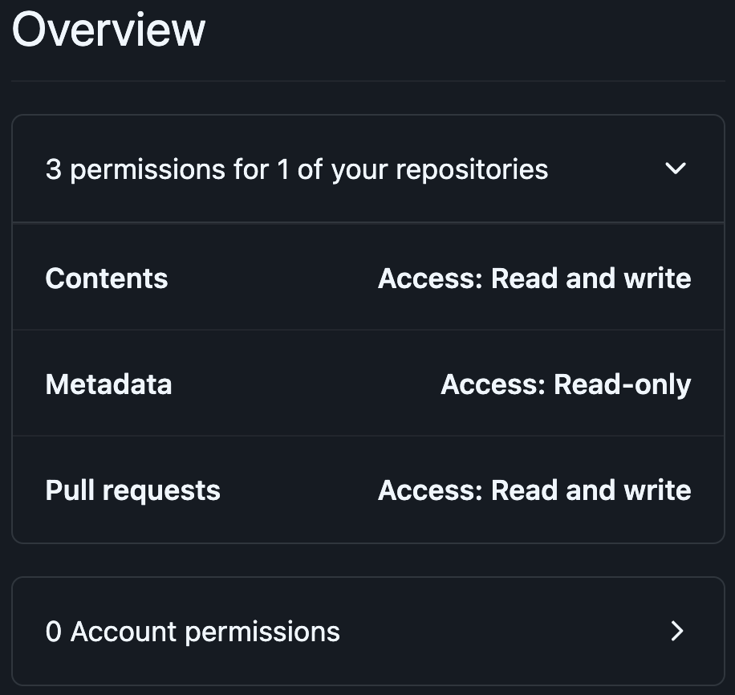
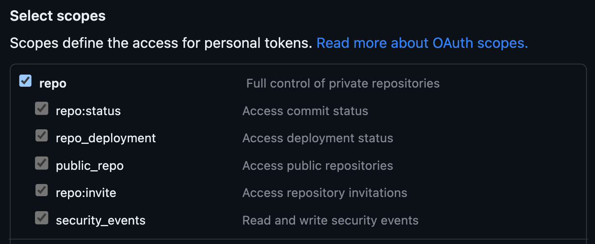

# GitHub token

GitHub Actions using the default
[`GITHUB_TOKEN`](https://docs.github.com/en/actions/security-guides/automatic-token-authentication)
cannot trigger other
[workflow](https://docs.github.com/en/actions/using-workflows/events-that-trigger-workflows)
runs, i.e. cannot start new GitHub Actions jobs.

You can learn more in the GitHub
[docs](https://docs.github.com/en/actions/using-workflows/triggering-a-workflow#triggering-a-workflow-from-a-workflow).

:::tip
To perform actions after release-plz runs without triggering further workflow runs,
you can use GitHub Action [output](./output.md).
:::

## Why you might need further workflow runs

Release-plz doesn't need to trigger further workflow runs to
open the release PR or release your packages.
However, you might need release-plz to trigger further workflow runs in the following cases.

### CI checks

Workflows acting as checks on pull requests opened by GitHub Actions
with the default GitHub token won't run.

For example, you might have CI checks that run:

- On a pull request:

  ```yaml
  on:
    pull_request:
  ```

- On push:

  ```yaml
  on:
    push:
  ```

If release-plz uses the default GitHub token, CI checks on the release PR
(i.e. the PR opened by release-plz) won't run.

### Actions after release

After `release-plz release` released the packages (typically after running on the `main` branch),
you can further trigger workflows, in the following ways:

- When a GitHub release is published:

  ```yaml
  on:
    release:
      types: [published]
  ```

- When a git tag is pushed:

  ```yaml
  on:
    push:
      tags:
        - "*"
   ```

This can be useful to announce automatically the release on socials
or to attach files (such as [binaries](../extra/releasing-binaries.md)) to the GitHub release.

If release-plz uses the default GitHub token, these workflows won't be triggered.

## How to trigger further workflow runs

To trigger further workflow runs from release-plz, use one of the following methods.

### Trigger workflow manually

To run `on: pull_request` workflows you can manually close and reopen the release pull request.

### Use a Personal Access Token

Use a [Personal Access Token (PAT)](https://docs.github.com/en/github/authenticating-to-github/creating-a-personal-access-token)
created on an account with write access to the repository.
This is the standard method
[recommended by GitHub](https://docs.github.com/en/actions/using-workflows/triggering-a-workflow#triggering-a-workflow-from-a-workflow).

:::info
The account that owns the PAT will be the author of the release pull
request and the commit itself.
If you don't want release-plz to open release pull requests and commit with
your account, consider creating a
[machine user](https://docs.github.com/en/get-started/learning-about-github/types-of-github-accounts#personal-accounts).
If your machine user needs a cool avatar, you can use the release-plz [logo](/img/robot_head.jpeg).
:::

Create the PAT, choosing one of the two types:

- [Fine-grained](https://docs.github.com/en/authentication/keeping-your-account-and-data-secure/creating-a-personal-access-token#fine-grained-personal-access-tokens):
  more secure because you can select the repositories where the PAT can be used.
  Follow [these](https://docs.github.com/en/authentication/keeping-your-account-and-data-secure/managing-your-personal-access-tokens#creating-a-fine-grained-personal-access-token)
  instructions, giving the PAT the following permissions:
  - Select the repositories where you want to use the PAT, to give release-plz write access:
    
  - Under "Repository permissions", assign "Contents" and "Pull requests" read and write permissions:
    
- [Classic](https://docs.github.com/en/authentication/keeping-your-account-and-data-secure/creating-a-personal-access-token#personal-access-tokens-classic):
  less secure because you can't scope it to a single repository.
  Follow [these](https://docs.github.com/en/authentication/keeping-your-account-and-data-secure/managing-your-personal-access-tokens#creating-a-personal-access-token-classic)
  instructions, giving the PAT `repo` permissions:
  

Once you generated your token, save it in the
[secrets](https://docs.github.com/en/actions/security-guides/encrypted-secrets),
and pass it to both the `actions/checkout` and `release-plz` steps:

```yaml
steps:
  - name: Checkout repository
    uses: actions/checkout@v4
    with:
      fetch-depth: 0
      # highlight-next-line
      token: ${{ secrets.RELEASE_PLZ_TOKEN }} # <-- PAT secret name
  - name: Install Rust toolchain
    uses: dtolnay/rust-toolchain@stable
  - name: Run release-plz
    uses: release-plz/action@v0.5
    env:
      # highlight-next-line
      GITHUB_TOKEN: ${{ secrets.RELEASE_PLZ_TOKEN }} # <-- PAT secret name
      CARGO_REGISTRY_TOKEN: ${{ secrets.CARGO_REGISTRY_TOKEN }}
    with:
      ...
```

:::warning
As shown in the example below,
you need to add the `token` field to the `actions/checkout` step, too.
This allows release-plz to use the PAT also when spawning `git` commands,
such as `git tag`.
:::

### Use a GitHub App

Generate a GitHub token with a GitHub App.
This is the approach used by the
[release-plz](https://github.com/MarcoIeni/release-plz/blob/main/.github/workflows/release-plz.yml)
repo itself. With this approach, the GitHub App will be the author of the release pull request,
e.g. `release-plz[bot]`.

Here's how to use a GitHub App to generate a GitHub token:

1. Create a minimal [GitHub App](https://docs.github.com/en/developers/apps/creating-a-github-app),
   setting the following fields:
   - Set `GitHub App name`.
   - Set `Homepage URL` to anything you like, such as your GitHub profile page.
   - Uncheck `Active` under `Webhook`. You do not need to enter a `Webhook URL`.
   - Under `Repository permissions: Contents` select `Access: Read & write`.
   - Under `Repository permissions: Pull requests` select `Access: Read & write`.
   - If you use [protected tags](https://docs.github.com/en/repositories/managing-your-repositorys-settings-and-features/managing-repository-settings/configuring-tag-protection-rules):
     Under `Repository permissions: Administration` select `Access: Read & write`.
   - (Optional) Under `Where can this GitHub App be installed?` select `Only on this account`.
   - (Optional) Set the release-plz [logo](/img/robot_head.jpeg).

2. Create a Private key from the App settings page and store it securely.

3. Install the App on the repositories where you want to run release-plz.

4. Store the GitHub App ID, and the private
   key you created in step 2 in GitHub
   [secrets](https://docs.github.com/en/actions/security-guides/encrypted-secrets).
   E.g. `APP_ID`, `APP_PRIVATE_KEY`.

5. Use
   [actions/create-github-app-token](https://github.com/actions/create-github-app-token)
   to generate a token from the GitHub Action:

   ```yaml
   steps:
   # highlight-start
     # Generating a GitHub token, so that PRs and tags created by
     # the release-plz-action can trigger actions workflows.
     - name: Generate GitHub token
       uses: actions/create-github-app-token@v1
       id: generate-token
       with:
         # GitHub App ID secret name
         app-id: ${{ secrets.APP_ID }}
         # GitHub App private key secret name
         private-key: ${{ secrets.APP_PRIVATE_KEY }}
   # highlight-end
     - name: Checkout repository
       uses: actions/checkout@v4
       with:
         fetch-depth: 0
   # highlight-next-line
         token: ${{ steps.generate-token.outputs.token }}
     - name: Install Rust toolchain
       uses: dtolnay/rust-toolchain@stable
     - name: Run release-plz
       uses: release-plz/action@main
       env:
   # highlight-next-line
         GITHUB_TOKEN: ${{ steps.generate-token.outputs.token }}
         CARGO_REGISTRY_TOKEN: ${{ secrets.CARGO_REGISTRY_TOKEN }}
       with:
         ...
   ```
