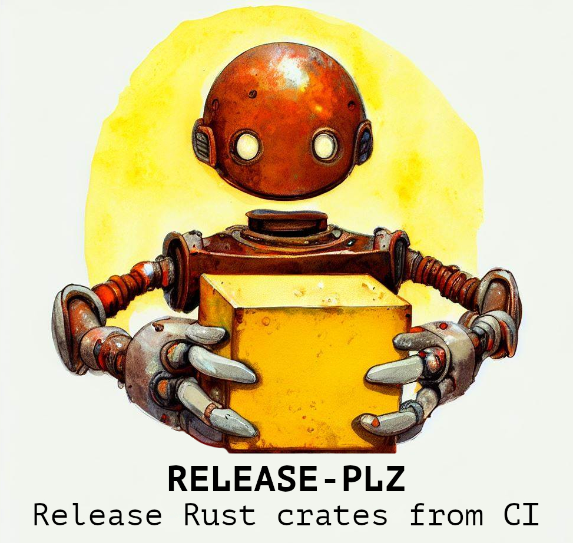

# Introduction

## No more manual releases

Releasing Rust packages is tedious and error-prone, just like most IT manual tasks.
For every package you want to release, you need to:

- Increase the version in `Cargo.toml`.
- Update the changelog.
- Publish the package in the cargo registry (for example, [crates.io](https://crates.io)).
- Create and push a git tag.

Meet [release-plz](https://github.com/MarcoIeni/release-plz), a Rust open-source
project that automates these tasks, allowing developers to release Rust packages
without the command line.

Release-plz creates a fully automated release pipeline, allowing you to
easily release changes more frequently, without the fear of
doing typos or other
subtle manual mistakes you can make when releasing from your terminal.

Here's an example of a release Pull Request created on the release-plz repository itself:

## Release-plz features

- Version update based on [conventional commits](https://www.conventionalcommits.org/).
- Changelog update with [git-cliff](https://git-cliff.org),
  using the [keep a changelog](https://keepachangelog.com/en/1.1.0/) format by default.
- API breaking changes detection with [cargo-semver-checks](https://github.com/obi1kenobi/cargo-semver-checks).
- Cargo workspaces support.
- No configuration required.
- Optional `cargo update` before releasing.
- Git tag created for every released package.
- Package published to any cargo registry.
- GitHub/Gitea releases.

## Releases made easy

Release-plz makes releasing Rust packages child's play:

1. For every commit, release-plz creates a release Pull Request from CI.
2. The release Pull Request reminds the maintainer about the unpublished changes.
3. The maintainer reviews and merges the pull request.
4. Release-plz releases the updated packages from CI.

In short, release-plz makes releasing Rust packages as easy as clicking the pull
request "merge" button.
