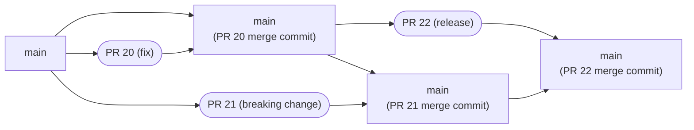

# release

The `release-plz release` command releases all the unpublished packages.

> For example, let's say you have a workspace with two packages: `pkg-a`
> (version 0.3.1) and `pkg-b` (version 0.2.2).
> The crates.io registry contains `pkg-a` version 0.3.1, but it doesn't contain
> `pkg-b` version 0.2.2 because you didn't publish this version yet.
> In this case, release-plz would release `pkg-b`.

For every release, release-plz:

- Creates a git tag named `<package_name>-v<version>` (e.g. `tokio-v1.8.1`).
  `<package_name>-` is omitted if there's only one package to publish.
- Publishes the package to the cargo registry by running `cargo publish`.
- Publishes a GitHub/Gitea/GitLab release based on the git tag.

:::info
`release-plz release` doesn't edit your `Cargo.toml` files and doesn't
push new commits. It releases the packages as they are in your repository.
For this reason, you typically use the `release-plz release` command in the main branch
after you run `release-plz update`
or you merge a pull request opened with `release-plz release-pr`.
:::

If all packages are already published, the `release-plz release` command does nothing.

To learn more, run `release-plz release --help`.

## Git Backends

GitHub is the default release-plz backend. You can use the `--backend` flag to
specify a different backend.

### Gitlab

`release-plz release` also supports creating releases for repositories hosted on Gitlab with
the `--backend gitlab` option:

You need to create a token in your Gitlab repo (Settings/Access Tokens) with the following
permissions:

- Role: `Maintainer` or higher
- Scopes:
  - `api` (to create a release)
  - `write_repository` (to create tag)

See the Gitlab [project access tokens](https://docs.gitlab.com/ee/user/project/settings/project_access_tokens.html)
docs.

Then you can run `release-plz release` with the following arguments:

`release-plz release --backend gitlab --git-token <gitlab_token>`

### Gitea

`releases-plz` supports creating releases on Gitea with the `--backend gitea` option.

Then you can run `release-plz release` in Gitea CI with the following arguments:

`release-plz release --backend gitea --git-token <gitea_token>`

The token needs to have the following permissions:

- `read:repository`, `write:repository`: to create git tags and releases.

TODO: document how to create a token on Gitea.

## Json output

You can get info about the outcome of this command by appending `-o json` to the command.
Stdout will contain info about the release:

```json
{
  "releases": [
    {
      "package_name": "<package_name>",
      "prs": "<prs>",
      "tag": "<tag_name>",
      "version": "<version>"
    }
  ]
}
```

Example:

```json
{
  "releases": [
    {
      "package_name": "my_crate",
      "prs": [
        {
          "html_url": "https://github.com/user/proj/pull/1439",
          "number": 1439
        }
      ],
      "tag": "v0.1.0",
      "version": "0.1.0"
    }
  ]
}
```

If release-plz didn't release any packages, the `releases` array will be empty.

### The `tag` field

The `tag` field is present even if the user disabled the tag creation with the
[`git_tag_enable`](../config.md#the-git_tag_enable-field) field.
This is because the user might want to use the tag name to create the tag
by themselves.

### The `prs` field

`prs` is an array of PRs present in the changelog body of the release.
Usually, they are the PRs containing the changes that were released.

Each entry of the array is an object containing:

- `html_url`: The URL of the PR.
- `number`: The number of the PR.

## What commit is released

:::info
This is an advanced section that describes certain design choices of release-plz,
mainly relevant for repositories with a merge queue enabled.
You can skip it if you are just getting started with release-plz
or if you are the only maintainer of your repository.
:::

To avoid race conditions when the release PR is merged,
`release-plz release` does a `git checkout` to the latest commit of the PR
before releasing (if the commit of the PR exists in the main branch).

Depending on the merge strategy you use, this can have different effects:

- If you merge with the
  [squash and merge](https://docs.github.com/en/repositories/configuring-branches-and-merges-in-your-repository/configuring-pull-request-merges/about-merge-methods-on-github#squashing-your-merge-commits)
  strategy, the `git checkout` won't happen because when you merge the PR to the main branch,
  GitHub creates a new commit,
  so release-plz won't find the commit of the PR and will release the latest commit
  of the main branch.
- If you merge with the
  [merge](https://docs.github.com/en/repositories/configuring-branches-and-merges-in-your-repository/configuring-pull-request-merges/about-merge-methods-on-github)
  strategy (the GitHub default), release-plz will release the last commit
  of the PR instead of the "Merge pull request" commit created by GitHub.

Takeaway: if you are concerned about PRs being released by mistake
(because you have a merge queue enabled or because your repository
has multiple maintainers), you should merge release PRs with the
default merge strategy.
Release-plz will handle the rest, avoiding race conditions happening when
the release PR is merged immediately after other PRs that aren't meant to be released. 👍

:::tip
If you are using the squash and merge strategy,
have a look at the [release_always](../config.md#the-release_always-field)
field of the configuration
:::

Here's an example of race condition that could happen if release-plz
didn't do the `git checkout` to the latest PR commit:

<details>
<summary>Merge queue example</summary>

1. Person A adds PR 20 to the merge queue (e.g. `@bors r+`).
2. Person B adds PR 21 to the merge queue.
3. PR 20 is merged into `main`.
4. Person A sees PR 20 is merged and adds the release PR (PR 22) to the merge queue.
5. PR 21 is merged into `main`.
6. PR 22 is merged into `main`. The `release-plz release-pr` workflow for PR 21 didn't
   finish in time, so the release PR is out of date.
7. `main`'s workflow runs that does the publish for PR 22.



This means that if release-plz didn't do the `git checkout`,
your release would include changes from PR 21 which will be missing from the changelog
and might contain breaking changes.

However, thanks to the `git checkout` to the latest commit of the PR,
if the release PR was merged into `main` with the default merge strategy, then
this race condition doesn't happen because the ancestor of the latest commit
of PR 22 is PR 20, not PR 21.

</details>
